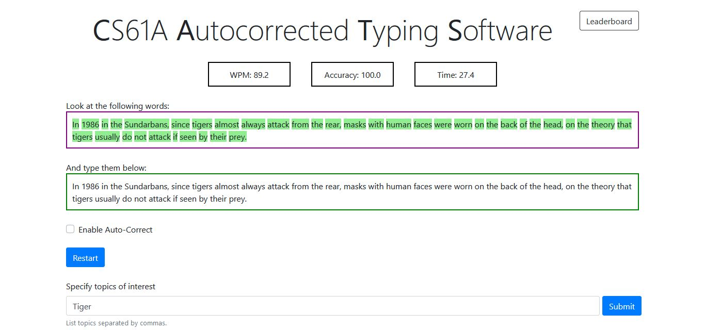

# Cats
This is a software that measures typing speed of a user which I built as a part of CS61A's curriculum. Additioanal features were implemented which enabled autocorrection and multiplayer mode. Building the autocorrect feature required knowledge of recursion. 
The starter files were provided and I only had to make changes in the cats.py file. The game's user interface is provided as a part of the starter files in the cats_gui.py file.

## Demo



## How to Play

```
python cats.py -t topic_name
```
Running this in terminal begins the game within the terminal and returns the WPM and Accuracy.

```
python cats_gui.py
```
Running this in terminal launches the user interface in a browser where the game can be played.

Note: The multiplayer mode can be accessed by changing the value of enable_multiplayer to True in the cats.py file.
